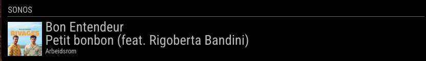
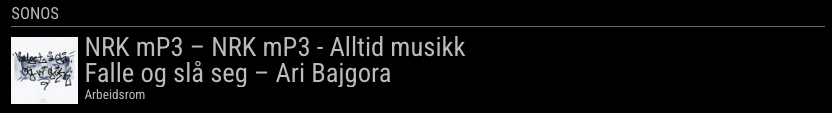

[](https://codeclimate.com/github/CFenner/MMM-Sonos)
[](https://github.com/jishi/node-sonos-http-api)
[](https://choosealicense.com/licenses/mit/)

# MMM-Sonos

# MagicMirror-Sonos-Module

This fork now differs quite a lot from the other MMM-Sonos modules. When playing radio stations from NRK (Norwegian Broadcasting) using their Sonos app, it looks up program and track info and displays it. Other sources use info from node-sonos-http-api.

This is an adaption and modification of of [Vaggan's](https://github.com/Vaggan) [MagicMirror-SonosModule](https://github.com/Vaggan/MagicMirror-SonosModule) and [CFenner's](https://github.com/CFenner) [MagicMirror-SonosModule](https://github.com/CFenner/MagicMirror-Sonos-Module). It was modified to get some enhancements in visualisation an configuration. Also the module hides itself when not playing now.

Screenshots:






## Usage

_Prerequisites_

- requires MagicMirror v2.0.0
- install and [run](https://github.com/MichMich/MagicMirror/wiki/Auto-Starting-MagicMirror) [node-sonos-http-api](https://github.com/jishi/node-sonos-http-api)

### Installation

In your terminal, go to your MagicMirror's Module folder:

```
cd ~/MagicMirror/modules
```

Clone this repository:

```
git clone https://github.com/theskyisthelimit/MMM-Sonos.git
```
Install Node-Modules
```
npm init
````
&
````
npm install request
````


Add some [config entries](#configuration) to your config.js file. After that the content will be added to your mirror.

### Configuration

To run the module properly, you need to add the following data to your config.js file.

```
{
	module: 'MMM-Sonos',
	header: "Playing on SONOS",
	position: "top_center", // This can be any of the regions, best results in center regions
	classes: "default everyone",
	config: {
		// See 'Configuration options' for more information.
	}
}
```

Here are the configuration options to configure the module.

| Option | Description |
|---|---| 
|`showStoppedRoom`|Trigger the visualization of stopped rooms.<br><br>**Default value:** `true`|
|`showAlbumArt`|Trigger the visualization of the album art.<br><br>**Default value:** `true`|
|`showRoomName`|Trigger the visualization of the room name.<br><br>**Default value:** `true`|
|`animationSpeed`|Lenght of the fade animation.<br><br>**Default value:** `1000`|
|`updateInterval`|Update interval.<br><br>**Default value:** `0.5`|
|`apiBase`|http link to the SONOS API.<br><br>**Default value:** `http://localhost'`|
|`apiPort`|SONOS API port.<br><br>**Default value:** `5005`|
|`apiEndpoint`|Link to the "zones" information on the SONOS API.<br><br>**Default value:** `zones`|
|`exclude`|Zones names to exclude ["Secret-Room","Greenhouse"].<br><br>**Default value:** `[]`|
|`includeRooms`|Zones names to include. If set, only show these zones or groups containing these zones. Zones in the exclude array are still excluded. ["Secret-Room","Greenhouse"].<br><br>**Default value:** `[]`|

### Custom-CSS

Here is my CSS settings for the module that I have added to my custom.css to give it the exta special look. :)

```

.sonos ul li .name {
  padding: 0 0 0 0;
  max-width: calc(100% - 120px);
}

.sonos ul li .room {
  padding: 0 0 15px 0;
}

.sonos ul li .art {
  padding: 0 0.25em 0 0;
}

.sonos ul li .art img {
  background-color: #fff;
}

```

### Known Issues

The module may not be able to access the data of the sonos API due to a Cross-Origin Resource Sharing (CORS) issue. This could be solved by adding the following lines to the `sonos-http-api.js` just before `res.write(new Buffer(jsonResponse));` in the sonos api. Remember to restart the service after the change.

```
  res.setHeader("Access-Control-Allow-Origin", "http://localhost");
  res.setHeader("Access-Control-Allow-Headers", "Origin, X-Requested-With, Content-Type, Accept");
```

### How to Install Sonos-API

To install the Sonos-API just clone the [repository](https://github.com/jishi/node-sonos-http-api) to your PI. 

```shell
git clone https://github.com/jishi/node-sonos-http-api.git
```
Navigate to the new node-sonos-http-api folder and install the node dependencies.
```shell
cd node-sonos-http-api && npm install --production
```
Now you can run the service with:

```shell
npm start
```
I really recommend to use PM2 like it is described on the MagicMirror [Wiki page](https://github.com/MichMich/MagicMirror/wiki/Auto-Starting-MagicMirror).
```shell
cd ~/Sonos
npm start
```


